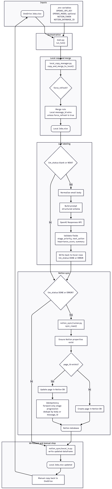
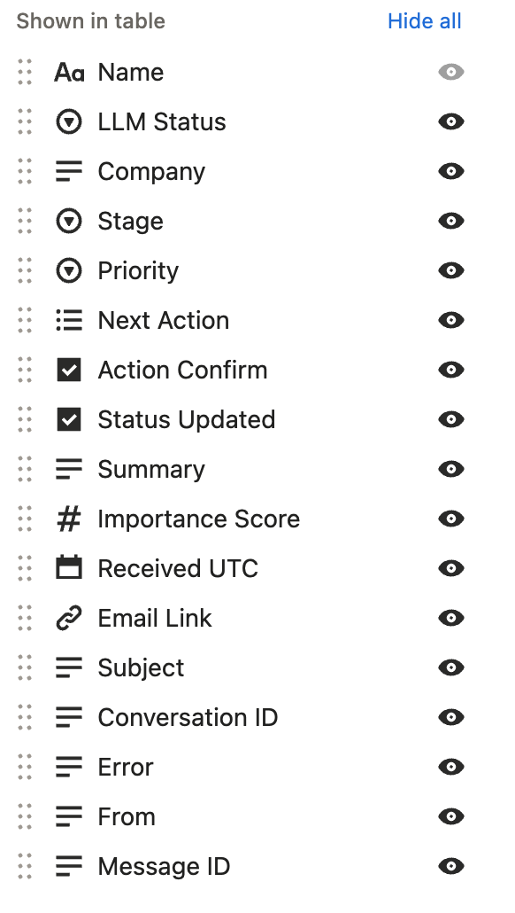

# 📥 Email → Notion Sync

Pull a OneDrive-hosted `Jobs.xlsx`, classify new rows with an LLM, and sync structured results to Notion—automatically, safely, and fast.



---

## ✨ Highlights
- 🟢 One-button run: copy from OneDrive, merge safely, label emails, and push to Notion in one command.
- 🧠 Trustworthy labels: stage, priority, next action, importance score, and summary stay within allowed enums/ranges.
- 🔁 Notion-friendly: missing properties are created, existing pages are updated, and duplicate body text is avoided.
- 🛡️ Safe merges: local edits win unless you force refresh; terminal stages cannot roll back.
- 📊 Excel-ready: cleaned artifacts and preserved styling keep the sheet easy to scan.

---

## 🚀 Quickstart
1) Install deps: `pip install -r requirements.txt`
2) Set env vars (or put them in `.env`): `OPENAI_API_KEY`, optional `OPENAI_MODEL`, `NOTION_TOKEN`, `NOTION_DATABASE_ID`
3) Have access to the OneDrive `Jobs.xlsx` (default path is in [main.py](main.py))
4) Run it all:
	 ```bash
	 python main.py
	 ```

### Common variants
- Force refresh (ignore local NEW rows):
	```bash
	python -c "from main import run_full; run_full(force_refresh=True)"
	```
- Point to another OneDrive path:
	```bash
	python -c "from main import run_full; run_full(onedrive_path='PATH/TO/Jobs.xlsx')"
	```
- Work only on the local copy:
	```bash
	python -c "from local_copy_manager import copy_and_merge_to_local; copy_and_merge_to_local('/path/to/Jobs.xlsx')"
	```

After processing, copy the local `Jobs.xlsx` back to OneDrive via Finder or `cp` if you need to manually sync upstream.

---

## 🛠️ How it works
1. [main.py](main.py) loads configuration and calls `run_full`.
2. [local_copy_manager.py](local_copy_manager.py) copies from OneDrive and smart-merges with any local file (local `message_id` rows stay authoritative unless `force_refresh=True`).
3. [LLM.py](LLM.py) selects blank/NEW rows, cleans bodies, builds prompts, calls the OpenAI Responses API, validates enums/ranges, stamps timestamps, and clears errors.
4. [notion_sync/runner.py](notion_sync/runner.py) walks DONE/ERROR rows, ensures Notion property types, and creates/updates pages via [notion_sync/notion_client.py](notion_sync/notion_client.py).
5. Forward-only stage logic and duplicate-body suppression live in [notion_sync/idempotency.py](notion_sync/idempotency.py) and [notion_sync/page_template.py](notion_sync/page_template.py).
6. The updated dataframe is written back to the local Excel file through [notion_sync/excel_io.py](notion_sync/excel_io.py).



---

## 🧭 File map
- Orchestration: [main.py](main.py)
- Copy/merge: [local_copy_manager.py](local_copy_manager.py)
- LLM prompt + schema: [LLM.py](LLM.py)
- Notion sync: [notion_sync/runner.py](notion_sync/runner.py) plus helpers in [notion_sync](notion_sync)
- Docs: [docs/PRODUCT_FEATURES.md](docs/PRODUCT_FEATURES.md), [docs/LOCAL_COPY_WORKFLOW.md](docs/LOCAL_COPY_WORKFLOW.md)


